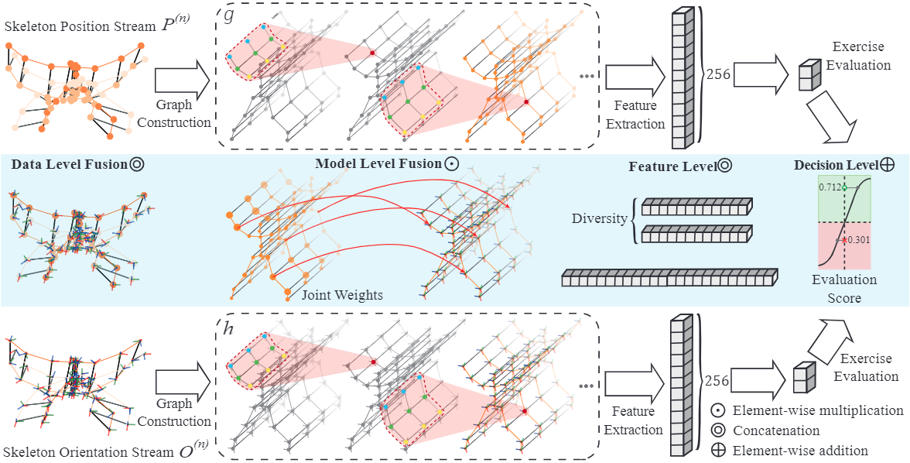

# EGCN++
EGCN++ model and the release of EHE dataset

## Public Release of the EHE Dataset
The EHE dataset is published on paper:
**Skeleton-based human action evaluation using graph convolutional network for monitoring Alzheimer’s progression**
Bruce X.B. Yu, Yan Liu, Keith C.C. Chan, Qintai Yang, Xiaoying Wang, Pattern Recognition 2021 ([PDF](https://www.sciencedirect.com/science/article/pii/S003132032100282X))

Available at [EHE](https://github.com/bruceyo/egcnplusplus/tree/main/EHE_dataset).

## EGCN++
EGCN is an advance version of [EGCN](https://github.com/bruceyo/EGCN) (IJCAI 2022).

    

Will be fully released soon. Please keep tuned.
